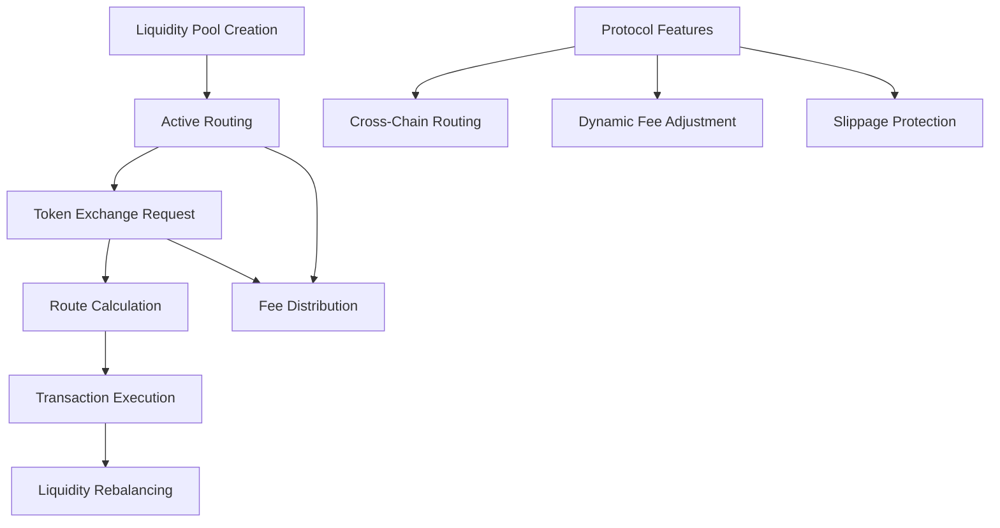

# Swap Connector

A decentralized cross-chain liquidity routing protocol that enables seamless, secure token exchanges across multiple blockchain networks. The Swap Connector provides advanced routing algorithms, optimized liquidity management, and transparent transaction tracking.

## Overview

Swap Connector creates an interoperable ecosystem where:
- Users can exchange tokens across different blockchain networks
- Liquidity providers can contribute to cross-chain pools
- Smart routing ensures optimal exchange rates
- Transactions are secure, transparent, and efficient

The protocol leverages blockchain technology to ensure:
- Cross-chain token transfers
- Minimal slippage
- Low transaction fees
- Decentralized liquidity management
- Secure routing algorithms

## Architecture



### Core Components
- Cross-Chain Routing Engine
- Liquidity Pool Management
- Dynamic Fee Calculation
- Transaction Tracking
- Slippage Protection Mechanisms

## Contract Documentation

### swap-connector.clar

The main contract managing cross-chain liquidity routing and token exchanges.

#### Key Features:
- Cross-chain token routing
- Liquidity pool management
- Dynamic fee calculation
- Transaction tracking
- Slippage protection

#### Access Control
- Liquidity providers: Can add/remove liquidity
- Users: Can perform cross-chain exchanges
- Protocol admin: Can adjust protocol parameters

## Getting Started

### Prerequisites
- Clarinet CLI installed
- Compatible blockchain wallet

### Basic Usage

1. Add Liquidity:
```clarity
(contract-call? .swap-connector add-liquidity 
    "ETH" 
    "USDC" 
    u1000000 
    u0.05)
```

2. Perform Cross-Chain Swap:
```clarity
(contract-call? .swap-connector swap-tokens 
    "ETH" 
    "USDC" 
    u500000 
    u0.01)
```

## Function Reference

### Public Functions

#### Liquidity Management
```clarity
(add-liquidity (token-a (string-ascii 20)) (token-b (string-ascii 20)) (amount uint) (max-slippage uint))
(remove-liquidity (token-a (string-ascii 20)) (token-b (string-ascii 20)) (liquidity-tokens uint))
```

#### Token Exchanges
```clarity
(swap-tokens (token-in (string-ascii 20)) (token-out (string-ascii 20)) (amount uint) (max-slippage uint))
(calculate-swap-output (token-in (string-ascii 20)) (token-out (string-ascii 20)) (amount uint))
```

## Development

### Testing
1. Clone the repository
2. Install dependencies: `clarinet install`
3. Run tests: `clarinet test`

### Local Development
1. Start Clarinet console: `clarinet console`
2. Deploy contract: `(contract-call? .swap-connector ...)` 

## Security Considerations

### Limitations
- Maximum liquidity per pool
- Minimum swap amounts
- Maximum slippage tolerance

### Best Practices
- Always check liquidity before swapping
- Use slippage protection
- Verify transaction output
- Consider gas costs
- Monitor dynamic fees

### Protocol Fees
- Liquidity provider fee: 0.3%
- Dynamic fee adjustment based on market conditions
- Slippage protection with configurable tolerance